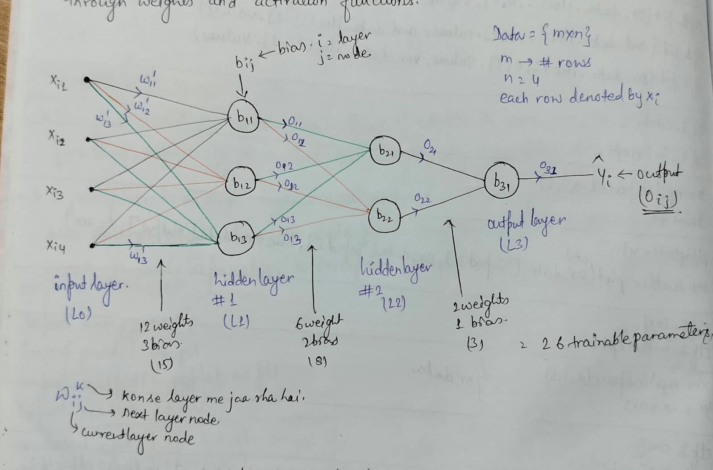

# Multi Layer Perceptron
>1.  Multi Layer Perceptron Notation refers to the symbolic representation used to illustrate the architecture and connections within a neural networks.
>
>2. In MLP, nodes(neurons) are organised into layers, including an input layer, hidden layer, and an output layer
>
>3. The notation visually represents the flow of information between layers through weights and activation functions.

# Neural Network Architecture

  

